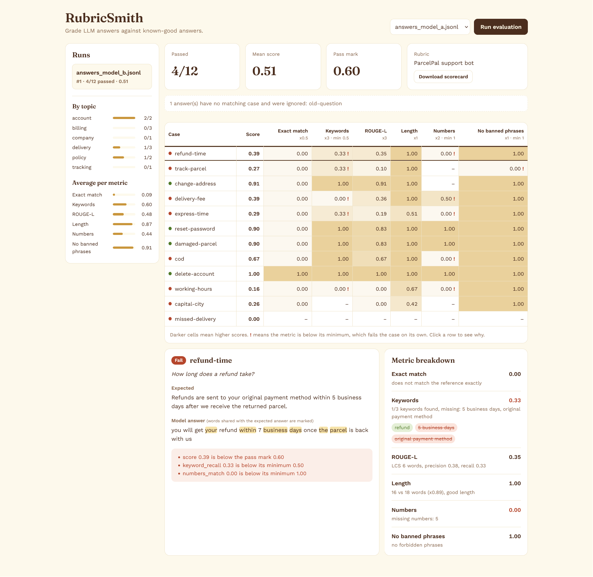
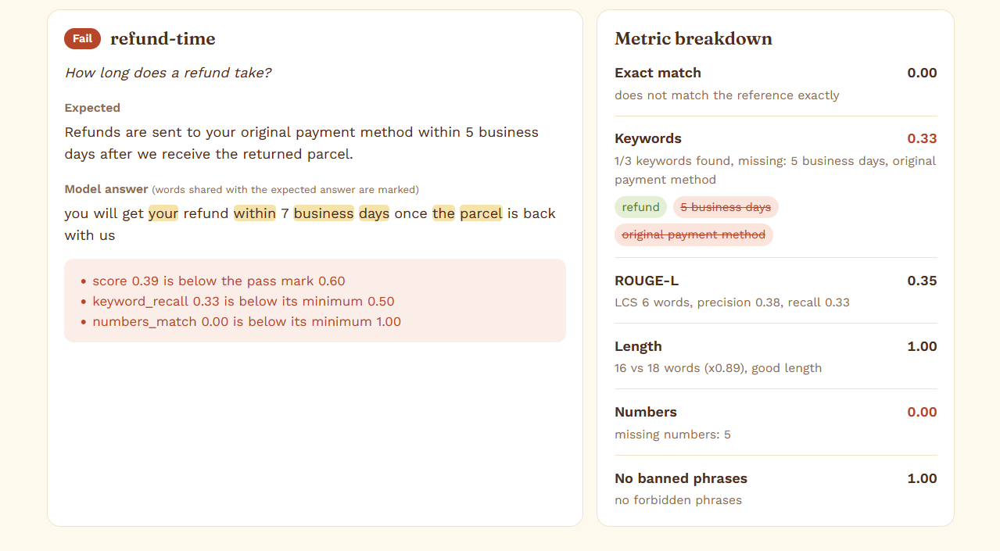
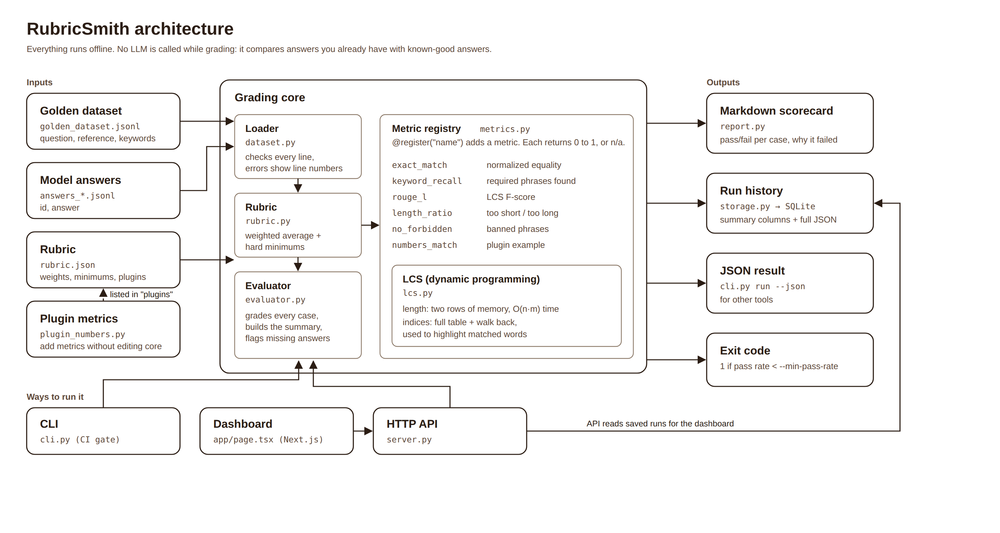

<style>
  body, p, li, td, th, h1, h2, h3, h4, h5, h6, code, pre {
    font-size: 12px;
  }
</style>

# RubricSmith

RubricSmith is a simple tool to grade LLM output against trusted answers. It runs offline without external dependencies.

You give it three files: test cases with expected answers, outputs from your model, and scoring rules. It calculates score metrics, sets pass or fail flags, and outputs a clean report.



## Why I Built This

Checking LLM outputs manually takes too much time when prompts or models change.

Using another LLM to score responses gets expensive quickly. It is also inconsistent because the grader model can give different scores for the same input. I wanted a fast, deterministic tool for local testing and CI pipelines. RubricSmith runs locally without API calls, so the same input always returns the same output.

## How It Works

1. Read test cases and model answers from JSONL files.
2. Run each scoring metric on every answer to get a value between 0 and 1.
3. Calculate a final score based on weights in your rubric.
4. Pass a test case only if its score hits the threshold and satisfies all minimum metric bounds.
5. Export a Markdown scorecard with details.



This example shows why minimum bounds matter. The generated output says "fails twice" while the expected answer says "2 failed attempts". Because the number matching metric requires an exact match, the test fails.

## Architecture



## Metrics

All scoring functions are written in standard Python.

| Metric | Description | Details |
|---|---|---|
| exact match | Compares output to reference text | Ignores case and basic symbols |
| keyword recall | Checks if required words are present | Looks for words in exact sequence |
| rouge l | Calculates word sequence match ratio | Uses longest common subsequence |
| length ratio | Compares length of output to reference | Checked against min and max ratio |
| no forbidden | Ensures banned words are absent | Checks both global and case rules |
| numbers match | Verifies numbers from reference are in output | Custom metric plugin example |

If a metric does not apply to a test case, it is skipped so it does not skew the average score.

### Adding Custom Metrics

Add a Python file inside backend, write your function, and reference it in rubric.json.

```python
# plugin-tone.py
from metrics import MetricResult, register

@register("no_shouting", "Fails if the answer is in all caps.")
def no_shouting(answer, case, params):
    shouting = answer.isupper()
    return MetricResult(0.0 if shouting else 1.0, "all caps" if shouting else "ok")
```

```json
"plugins": ["plugin-numbers", "plugin-tone"],
"metrics": { "no_shouting": {"weight": 1, "min": 1.0} }
```

## Quick Start

Requirements: Python 3.10+ and Node.js 18+

1. Run evaluation from terminal:

```bash
git clone https://github.com/your-username/RubricSmith.git
cd RubricSmith/backend
python cli.py run --answers answers_model_a.jsonl
python cli.py run --answers answers_model_b.jsonl --out scorecard.md --save
```

2. Run local API server:

```bash
python server.py
```

Server runs on http://127.0.0.1:8010.

3. Run web dashboard in another terminal:

```bash
cd RubricSmith/frontend
npm install
npm run dev
```

Open http://localhost:3000 in your browser, pick an answer file, and start the evaluation.

## CLI Usage

Run these commands inside the backend directory.

```bash
# Evaluate an answer file
python cli.py run --answers answers_model_a.jsonl

# Generate scorecard, save json output, and store run history
python cli.py run --answers answers_model_b.jsonl --out scorecard.md --json run.json --save

# Fail CI pipeline if pass rate is below 90 percent
python cli.py run --answers answers_model_a.jsonl --min-pass-rate 0.9

# Test a single pair directly
python cli.py score --reference "Refunds take 5 business days." --answer "Refunds take 7 business days." --keywords "refund"

# View available metrics and past runs
python cli.py metrics
python cli.py runs
```

Exit codes:
- 0: Passed
- 1: Failed threshold
- 2: Invalid input file format

## Input File Formats

Golden dataset file (golden-dataset.jsonl):

```json
{"id": "refund-time", "question": "How long does a refund take?", "reference": "Refunds are sent to your original payment method within 5 business days...", "keywords": ["refund", "5 business days"], "aliases": [], "forbidden": [], "tags": ["billing"]}
```

Model answers file:

```json
{"id": "refund-time", "answer": "Your refund goes back to..."}
```

Rubric configuration file (rubric.json):

```json
{
  "name": "ParcelPal support bot",
  "pass_threshold": 0.6,
  "plugins": ["plugin-numbers"],
  "metrics": {
    "keyword_recall": {"weight": 3, "min": 0.5},
    "rouge_l": {"weight": 3},
    "length_ratio": {"weight": 1, "params": {"min_ratio": 0.5, "max_ratio": 2.5}}
  }
}
```

## API Endpoints

| Method | Endpoint | Purpose |
|---|---|---|
| GET | /api/health | Check server status |
| GET | /api/metrics | List available metrics |
| GET | /api/rubric | Get active rubric rules |
| GET | /api/files | List available test and answer files |
| GET | /api/runs | Fetch evaluation history |
| POST | /api/runs | Execute evaluation run |
| GET | /api/runs/id | Get details for a specific run |
| GET | /api/runs/id/scorecard | Download Markdown scorecard |
| DELETE | /api/runs/id | Remove a saved run |
| POST | /api/score | Grade a single answer pair |

## Running Tests

```bash
cd backend
pip install -r requirements-dev.txt
python -m pytest
```

The test suite includes 91 unit and integration tests covering metric logic, error handling, SQLite persistence, and API routes.

## Repository Structure

```
RubricSmith/
├── README.md
├── LICENSE
├── backend/
│   ├── text_utils.py          text cleaning and phrase matching
│   ├── lcs.py                 longest common subsequence algorithm
│   ├── metrics.py             builtin metrics and registry
│   ├── plugin_numbers.py      number check metric plugin
│   ├── dataset.py             jsonl reader with line error details
│   ├── rubric.py              scoring logic and pass fail rules
│   ├── evaluator.py           evaluation runner
│   ├── report.py              markdown scorecard builder
│   ├── storage.py             sqlite storage layer
│   ├── server.py              lightweight http server
│   ├── cli.py                 command line interface
│   ├── config.py              environment settings
│   ├── golden_dataset.jsonl   sample test dataset
│   ├── answers_model_a.jsonl  sample model outputs
│   └── rubric.json            scoring configuration
├── frontend/
│   ├── app/                   dashboard user interface
│   ├── package.json
│   └── tsconfig.json
└── docs/
    ├── CASE_STUDY.md          background and context
    └── architecture.png
```

## Limitations

- Metrics perform text comparison, not semantic evaluation.
- ROUGE L rewards exact phrasing and might penalize valid rephrasing.
- Keyword matching handles basic plurals but not complex word variations.
- High quality test sets still require manual ground truth creation.

## License

MIT